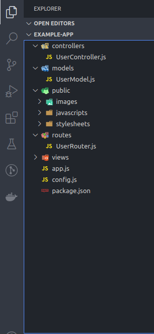

**NODEJS FOLDER STRUCTURES**

__dosya tabanlı__

- app.js      : Bu dosya server'in başlaması için gerekli olan dosyadır. tüm mantık bu dosya üzerinde kuruludur.
- config.js   : Bu dosya gizli bilgileri içerir. PORT numarası, secret keyler gibi ve Git reposuna commit edilmemelidir!

__klasör tabanlı__

- Controllers : Bu klasör projenin asıl iş mantığını içerir. örn. Veritabanı işlemleri, Giriş yapma ve kayıt olma gibi işlemler
- Models      : Tüm veritabanı modellerinin yazıldığı kısım burasıdır. (örn. UserModel.js)
- Public      : Tüm `public` dosyaları bu klasörde bulunur (html, css, javascript (ajax, bootstrap gibi frontend dosyaları))
- Routes      : Tüm `route` bağımlı tanımlamalar/işlemler bu klasör içinde olmalıdır. Api üzerinde gidilecek yollar ve o yollara bağlı olarak getirilecek olan veriler burda tanımlanır
- Views       : Bu klasör html/ejs gibi dosyaları içerir. Yani aslında frontend kısmı burda tanımlanır.

**Genel Folder Structure Yapısı**

